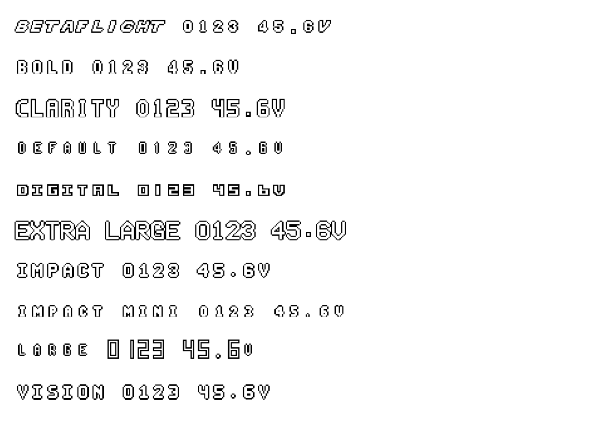
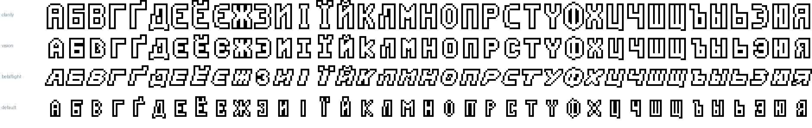
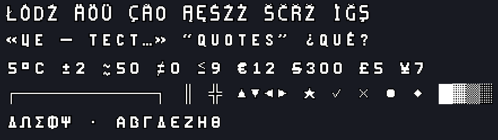

[English](README.md) · [Довідник символів](docs/SYMBOLS_UA.md) · [Доки для розробників](docs/DEVELOPERS_UA.md)

# Шрифти Betaflight OSD для дизайнерів

Десять стокових шрифтів Betaflight OSD, сконвертованих для роботи поза
окулярами: **OTF** і **TTF** для встановлення, **WOFF** і **WOFF2** для вебу,
і всі 256 символів окремими **PNG** з прозорим фоном.

Кольорові шрифти, тому білий символ зберігає чорну обводку на будь-якому
відео. Повна кирилиця, латиниця з діакритикою, грека, друкарська пунктуація,
математика, валюти й псевдографіка — усе зібране з форм самого шрифта. Для
FPV-прев'ю, оверлеїв на стрімі, титрів і всього, що має виглядати як
справжній дронячий OSD.

Вихідні файли це `.mcm` від MAX7456 з betaflight-configurator.
[`bf2font.py`](bf2font.py) так само конвертує будь-який інший `.mcm`.

## Шрифти

Висота великої літери в пікселях OSD, з клітинки у 18 пікселів.

| Шрифт | Висота | Який він |
| --- | --- | --- |
| `extra_large` | 16 | найбільший, заповнює клітинку |
| `clarity` | 15 | великий і чистий, контрастний |
| `bold` | 12 | жирний, вузький |
| `impact` | 12 | жирний, ширший |
| `vision` | 12 | той самий розмір, що `impact`, але свої накреслення |
| `betaflight` | 10 | нахилений, фірмовий вигляд |
| `impact_mini` | 10 | компактна версія `impact` |
| `default` | 10 | тонкий стоковий, найменший |
| `large` | 10 | малі літери з високими цифрами на 15 пікселів |
| `digital` | 9 | низький, блоки на всю ширину, як сегментний індикатор |

## Кирилиця

Повна кирилиця, у кожному шрифті, на звичних кодпойнтах.
Малі літери друкуються великими, як і латиниця.

Кирилиця кожного шрифта пасує саме йому: `clarity` тримає товщину clarity,
`betaflight` тримає свій нахил.

Лише у файлах шрифтів. Саме OSD кирилицю не покаже.

## Усе решта, чого в OSD не було

Вихідні шрифти — це ASCII та іконки. Решту домальовано тут, з товщиною,
стійками й нахилом кожного конкретного шрифта:

| Набір | Що покриває |
| --- | --- |
| Латиниця з діакритикою | `Latin-1` і вживана частина `Latin Extended-A`: ÄÖÜ ÁÉÍÓÚ ÀÈÊ ÅØ ÑÇ ŁĄĆĘŃŚŹŻ ČŠŽŘĎŤŇĚŮ ĂÎȘȚ ĞİŞ ÐÞ |
| Грека | усі великі літери, від ΑΒΓΔ до ΧΨΩ |
| Пунктуація | – — … « » ‹ › “ ” ‘ ’ „ • · ¿ ¡ ° ′ ″ § — і `{ } $ ~` \`, які у вихідному шрифті зайняті іконками |
| Математика й валюти | ± × ÷ − ≠ ≈ ≤ ≥ ∞ µ · € £ ¥ ¢ ₴ ₽ |
| Блоки | ─ │ ┼ ═ ║ ╬ і решта псевдографіки, █ ▓ ▒ ░, ▲ ▼ ◀ ▶ ● ○ ◆ ■ ★ ✓ ✗ |

Кілька символів не втискаються в клітинку на 12 пікселів, тому просто
розкладаються на літери — як і зробила б будь-яка капітельна гарнітура:
Æ набирається як AE, ß як SS, ™ як TM, № як N°, ½ як 1/2, © як (C).

## Символи за назвою

Дві третини шрифта Betaflight — це іконки. Пиши назву між двокрапками, і
з'явиться іконка: `:battery:`, `:home:`, `:arrow_n:`, `:rssi:`, `:flag:` —
у будь-якому застосунку з лігатурами OpenType, тобто в браузерах, у тексті
macOS і Windows, в Adobe та Affinity.

Стрілки, символ дому й градуси Цельсія доступні ще й своїми стандартними
символами: ↑ ↓ ← → ↖ ↗ ↘ ↙ ⌂ ℃ ℉. За кожною іконкою також лишається її
кодпойнт `U+E000 + індекс`.

**[Повний довідник символів →](docs/SYMBOLS_UA.md)**

## Завантажити

Усе лежить в репо, нічого збирати не треба. Бери
[архів цілком](https://github.com/volempdoge/betaflight-designer-fonts/archive/refs/heads/main.zip)
або відкривай `output//`:

| | |
| --- | --- |
| `fonts/otf/`, `fonts/ttf/` | для встановлення |
| `fonts/woff/`, `fonts/woff2/` | для вебу |
| `png/` | усі 256 символів, кожен окремим PNG з прозорим фоном |
| `png/<set>/` | зібрані символи, кожен окремим PNG, назва — кодпойнт |
| `_sheet.png` | весь набір символів одним аркушем 16×16 |
| `_<set>.png` | по аркушу на кожен зібраний набір |
| `.json` | покажчик: кожен символ, набір та іконка з кодпойнтами |

У кожній теці формату лежать три гарнітури: кольорова та пласка пара `Shadow` і
`Fill` для програм, які кольорових шрифтів не читають.

## Чорна обводка вже у шрифті

Пишеш поверх відео, і обводка вже на місці, без стилів шару.

Кольори працюють у будь-якому сучасному браузері та в тексті macOS і Windows.
**Figma кольорових шрифтів не підтримує**, в Adobe залежить від програми та
версії. Без кольору вийдуть плоскі білі літери, форма правильна, обводки нема.

### Figma та інші програми без кольорових шрифтів

Клади два текстові шари: `Shadow` чорним знизу, `Fill` білим зверху, той самий
текст, кегль і позиція. Усі три гарнітури мають однакові метрики, тому шари
збігаються точно, а текст лишається редагованим.

## Як друкувати

- Латиниця, кирилиця, грека, цифри й пунктуація друкуються як завжди. Малі
  літери виходять великими — у кожному письмі, бо малих у цих шрифтах нема
  взагалі.
- `$`, `~` і `` ` `` тут намальовані як самі себе. У вихідному шрифті ці
  комірки зайняті картатим прапорцем, прицілом і стрілкою — вони нікуди не
  зникли, це `:flag:`, `:crosshair:` і `:arrow_s:`.
- Кожен символ доступний ще й за `U+E000 + індекс`, тобто `0x01` це `U+E001`.
  Саме там стрілки, іконки батареї та сигналу, символи GPS і режимів польоту,
  плитки логотипа. Що де лежить видно на аркуші символів і в
  `output//.json`.

Більше подобаються картинки? Кидай PNG прямо на таймлайн чи на полотно.

## Стенд віз юкрейн

зараз ви або в армії, або працюєте на армію, дякую

нагадую за донати на підтримку України:
- https://savelife.in.ua/donate/
- https://prytulafoundation.org

## Юридичні приколи приколдяси і все таке

Оригінальні файли шрифтів взяті безпосередньо з репозиторію [betaflight/betaflight-configurator](https://github.com/betaflight/betaflight-configurator), який розповсюджується під ліцензією GNU General Public License v3.0.

Відповідно до умов оригінальної ліцензії, цей репозиторій та всі його матеріали також ліцензуються під **GNU General Public License v3.0**.

Повний текст ліцензії доступний у файлі `LICENSE` в цьому репозиторії.
