[← README](../README.md) · [Developer docs](DEVELOPERS.md) · [Українською](SYMBOLS_UA.md)

# OSD symbols

The Betaflight fonts spend two thirds of their 256 characters on icons rather
than letters. Every one of them is reachable three ways: type its name between
colons, use its private use codepoint, or -- where the icon is also a standard
character -- type that character.

Images below are cut from `clarity`; every font draws the same set in its
own weight.

## Battery and power

| | Type | Also at | Private use |
| --- | --- | --- | --- |
| 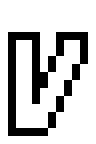 | `:volt:` | — | `U+E006` |
| 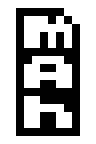 | `:mah:` | — | `U+E007` |
| 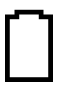 | `:batt_full:` | — | `U+E090` |
| 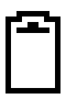 | `:batt_5:` | — | `U+E091` |
| 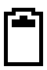 | `:batt_4:` | — | `U+E092` |
| 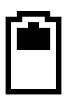 | `:batt_3:` | — | `U+E093` |
|  | `:batt_2:` | — | `U+E094` |
| 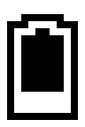 | `:batt_1:` | — | `U+E095` |
| 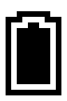 | `:batt_empty:` | — | `U+E096` |
| 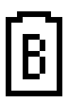 | `:battery:` | U+1F50B | `U+E097` |
| 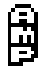 | `:amp:` | — | `U+E09A` |

## Telemetry

| | Type | Also at | Private use |
| --- | --- | --- | --- |
| 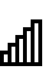 | `:rssi:` | U+1F4F6 | `U+E001` |
| 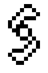 | `:throttle:` | — | `U+E004` |
| 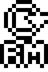 | `:rpm:` | — | `U+E012` |
| 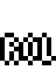 | `:roll:` | — | `U+E014` |
| 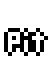 | `:pitch:` | — | `U+E015` |
| 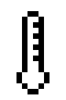 | `:temperature:` | U+1F321 | `U+E07A` |
| 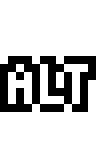 | `:altitude:` | — | `U+E07F` |

## GPS and navigation

| | Type | Also at | Private use |
| --- | --- | --- | --- |
| 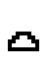 | `:over_home:` | — | `U+E005` |
| 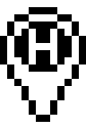 | `:home:` | `⌂` U+2302 | `U+E011` |
| 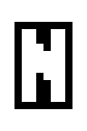 | `:heading_n:` | — | `U+E018` |
| 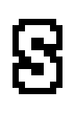 | `:heading_s:` | — | `U+E019` |
|  | `:heading_e:` | — | `U+E01A` |
| 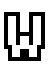 | `:heading_w:` | — | `U+E01B` |
| 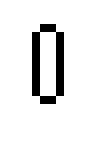 | `:heading_divider:` | — | `U+E01C` |
| 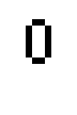 | `:heading_line:` | — | `U+E01D` |
| 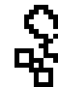 | `:sat_left:` | — | `U+E01E` |
| 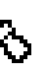 | `:sat_right:` | — | `U+E01F` |
| 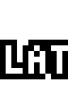 | `:latitude:` | — | `U+E089` |
|  | `:longitude:` | — | `U+E098` |

## Arrows

| | Type | Also at | Private use |
| --- | --- | --- | --- |
| 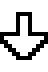 | `:arrow_s:` | `↓` U+2193 | `U+E060` |
| 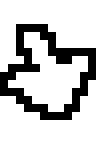 | `:arrow_sse:` | — | `U+E061` |
| 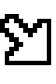 | `:arrow_se:` | `↘` U+2198 | `U+E062` |
| 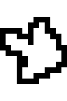 | `:arrow_ese:` | — | `U+E063` |
| 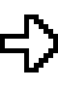 | `:arrow_e:` | `→` U+2192 | `U+E064` |
| 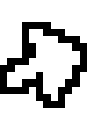 | `:arrow_ene:` | — | `U+E065` |
| 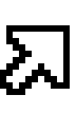 | `:arrow_ne:` | `↗` U+2197 | `U+E066` |
| 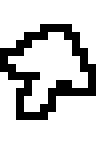 | `:arrow_nne:` | — | `U+E067` |
| 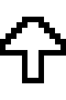 | `:arrow_n:` | `↑` U+2191 | `U+E068` |
| 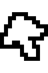 | `:arrow_nnw:` | — | `U+E069` |
| 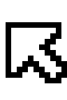 | `:arrow_nw:` | `↖` U+2196 | `U+E06A` |
| 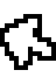 | `:arrow_wnw:` | — | `U+E06B` |
| 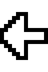 | `:arrow_w:` | `←` U+2190 | `U+E06C` |
| 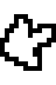 | `:arrow_wsw:` | — | `U+E06D` |
| 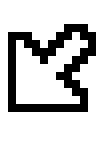 | `:arrow_sw:` | `↙` U+2199 | `U+E06E` |
| 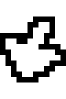 | `:arrow_ssw:` | — | `U+E06F` |
| 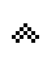 | `:arrow_small_up:` | `▴` U+25B4 | `U+E075` |
| 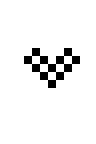 | `:arrow_small_down:` | `▾` U+25BE | `U+E076` |
| 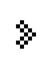 | `:arrow_small_right:` | `▸` U+25B8 | `U+E077` |
| 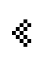 | `:arrow_small_left:` | `◂` U+25C2 | `U+E078` |

## Artificial horizon

| | Type | Also at | Private use |
| --- | --- | --- | --- |
| 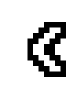 | `:ah_right:` | — | `U+E002` |
| 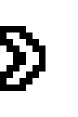 | `:ah_left:` | — | `U+E003` |
| 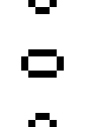 | `:ah_decoration:` | — | `U+E013` |
|  | `:ah_corner_left:` | — | `U+E072` |
|  | `:ah_corner_right:` | — | `U+E073` |
|  | `:ah_corner_low:` | — | `U+E074` |
|  | `:ladder:` | — | `U+E07C` |
|  | `:crosshair:` | `⌖` U+2316 | `U+E07E` |
|  | `:ah_bar_0:` | — | `U+E080` |
|  | `:ah_bar_1:` | — | `U+E081` |
|  | `:ah_bar_2:` | — | `U+E082` |
|  | `:ah_bar_3:` | — | `U+E083` |
|  | `:ah_bar_4:` | — | `U+E084` |
|  | `:ah_bar_5:` | — | `U+E085` |
|  | `:ah_bar_6:` | — | `U+E086` |
|  | `:ah_bar_7:` | — | `U+E087` |
|  | `:ah_bar_8:` | — | `U+E088` |

## Units

| | Type | Also at | Private use |
| --- | --- | --- | --- |
|  | `:metres:` | — | `U+E00C` |
|  | `:fahrenheit:` | `℉` U+2109 | `U+E00D` |
|  | `:celsius:` | `℃` U+2103 | `U+E00E` |
|  | `:feet:` | — | `U+E00F` |
|  | `:ft_per_s:` | — | `U+E099` |
|  | `:mph:` | — | `U+E09D` |
|  | `:kph:` | — | `U+E09E` |
|  | `:m_per_s:` | — | `U+E09F` |

## Time

| | Type | Also at | Private use |
| --- | --- | --- | --- |
|  | `:on_hours:` | — | `U+E070` |
|  | `:fly_hours:` | — | `U+E071` |
|  | `:prev_lap:` | — | `U+E079` |
|  | `:on_minutes:` | — | `U+E09B` |
|  | `:fly_minutes:` | — | `U+E09C` |

## Progress bar

| | Type | Also at | Private use |
| --- | --- | --- | --- |
|  | `:progress_start:` | — | `U+E08A` |
|  | `:progress_full:` | — | `U+E08B` |
|  | `:progress_half:` | — | `U+E08C` |
|  | `:progress_empty:` | — | `U+E08D` |
|  | `:progress_end:` | — | `U+E08E` |
|  | `:progress_close:` | — | `U+E08F` |

## Stick overlay

| | Type | Also at | Private use |
| --- | --- | --- | --- |
|  | `:stick_high:` | — | `U+E008` |
|  | `:stick_mid:` | — | `U+E009` |
|  | `:stick_low:` | — | `U+E00A` |
|  | `:stick_centre:` | — | `U+E00B` |
|  | `:stick_vertical:` | — | `U+E016` |
|  | `:stick_horizontal:` | — | `U+E017` |

## Status

| | Type | Also at | Private use |
| --- | --- | --- | --- |
|  | `:blackbox:` | — | `U+E010` |
|  | `:flag:` | U+1F3C1 | `U+E024` |

## The logo

The last 96 characters are the Betaflight logo, cut into tiles 24 wide and 4 tall, in reading order: `:logo_00:` is the top left tile, `:logo_95:` the bottom right. Set them on consecutive lines with no line spacing and the picture comes back.

